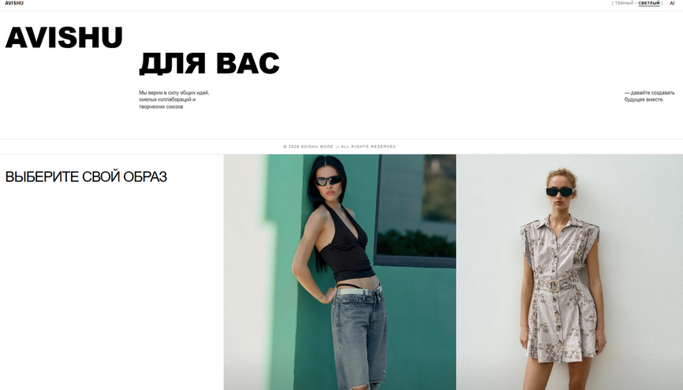
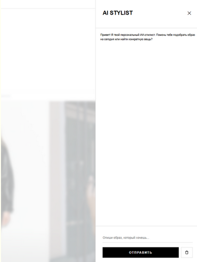
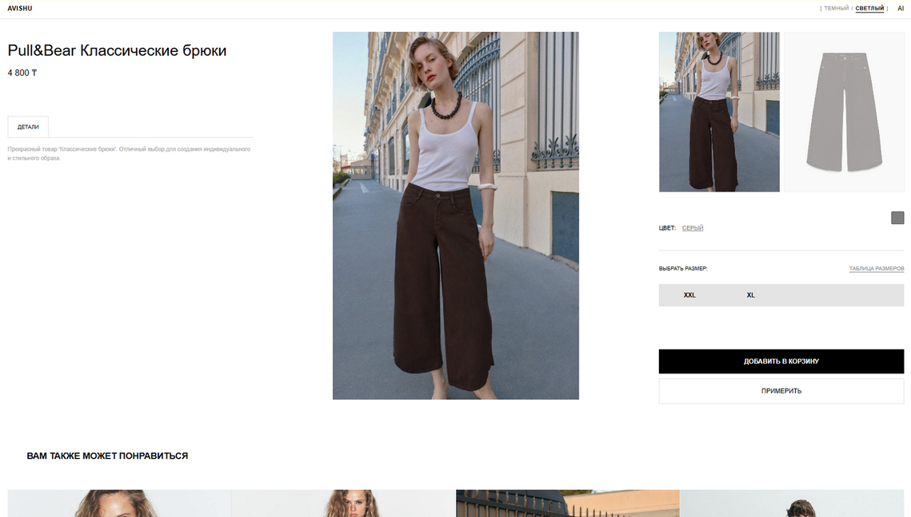
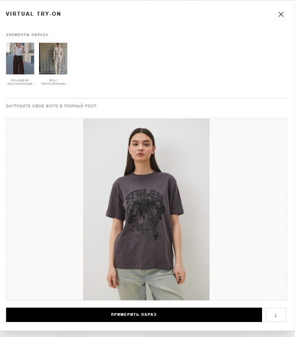
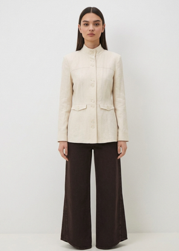

# AI Stylist — интеллектуальный виртуальный стилист для интернет-магазина

---

# 📷 Главная страница магазина



---

# 📷 Кнопка AI и открытие сайдбара



---

# 📌 Описание проекта

AI Stylist — это интеллектуальный виртуальный стилист, встроенный в сайдбар интернет-магазина одежды.
Система позволяет пользователю получать персонализированные подборки образов на основе текстового запроса и примерять одежду с помощью AI.

Проект объединяет рекомендации товаров, диалоговый интерфейс и виртуальную примерку в единую систему.

---

# 🚀 Функциональность

## 🧠 AI-стилист в сайдбаре

При нажатии на кнопку **AI** в углу сайта открывается сайдбар с виртуальным стилистом.

### Возможности:

- Принимает описание желаемого образа в свободной форме
- Анализирует запрос через Gemini API
- Сопоставляет запрос с тегами товаров в базе данных
- Формирует персонализированные подборки одежды
- Показывает карточки товаров прямо в чате
- Позволяет переходить на страницы товаров

---

# 📷 Диалог со стилистом


---

## 👗 Генерация образа

Пользователь описывает желаемый стиль, например:

> “Оверсайз уличный стиль в чёрных тонах для осени”

Далее система:

1. Отправляет запрос в Gemini API
2. Анализирует смысл и извлекает параметры стиля
3. Подбирает товары из базы по тегам
4. Формирует полноценный образ
5. Возвращает кликабельные карточки товаров в чат

---

# 🛠️ Технологический стек

## Backend

- Python
- Django
- Django REST Framework (DRF)

## Frontend

- React

## AI-интеграции

- Gemini API — анализ запроса и подбор стиля
- Nano Banana API — виртуальная примерка одежды

---

# 🧩 Архитектура системы

```text
Пользователь
    ↓
React (сайдбар AI)
    ↓
DRF API (backend)
    ↓
Gemini API (анализ запроса)
    ↓
База данных товаров (по тегам)
    ↓
Формирование образа
    ↓
Nano Banana API (примерка)
    ↓
Результат пользователю
```

---

# 📷 Страница товара (детали)



---

# 📷 Загрузка изображения пользователя



---

# 📷 Результат виртуальной примерки



---

# ⚙️ Итог

Система позволяет пользователю:

- находить образы через диалог
- получать персонализированные рекомендации
- сразу примерять одежду на себе
- переходить к покупке выбранных товаров
